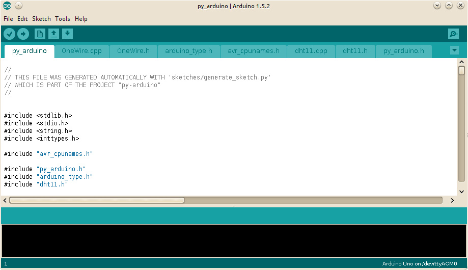

## Install from GitHub in 4 steps

#### Step 1: clone the repository & cd to it

    ~/$ git clone https://github.com/hgdeoro/py-arduino.git
    ~/$ cd py-arduino
    ~/py-arduino$

#### Step 2: create a virtualenv & install required libraries

    ~/py-arduino$ virtualenv -p python2.7 virtualenv
    ~/py-arduino$ . virtualenv/bin/activate
    (virtualenv)~/py-arduino$ pip install -r requirements.txt
    (virtualenv)~/py-arduino$

#### Step 3: open the sketch and upload

Open the sketch at `py-arduino/sketches/py_arduino/py_arduino.ino`,
verify and upload to Arduino.

#### Step 4: test it

    (virtualenv)~/py-arduino$  python -m py_arduino.cli.ping /dev/ttyACM0
    Ping sent... OK - Time=18.295 ms
    Ping sent... OK - Time=19.658 ms
    Ping sent... OK - Time=23.358 ms
    ^C
    (virtualenv)~/py-arduino$

## A note about virtualenv

You must activate the [virtualenv](http://www.virtualenv.org) to use py-arduino, using something like:

`source /path/to/py-arduino/virtualenv/bin/activate`

or

`. /path/to/py-arduino/virtualenv/bin/activate`

(note the __space__ between the __.__ and the path to __activate__).

After activating the virtualenv, your prompt will chage: a __(virtualenv)__ will be prepended.

#### Common problems

If you have problems, check <a href="{{ site.baseurl }}/docs/common-problems/">Common problems</a>,
<a href="https://github.com/hgdeoro/py-arduino/issues">file a bug</a> or contact me.

