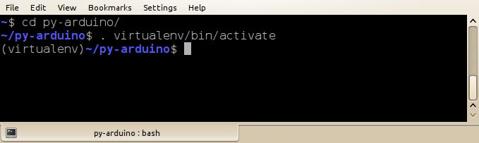
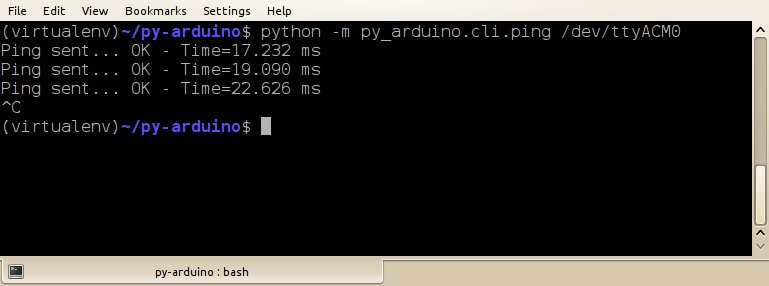
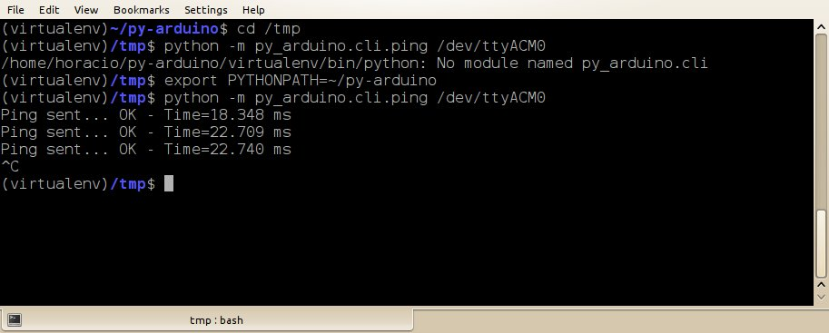

## How to use py_arduino.cli.* after install

You can start using py-arduino from the command line interface (__cli__) without actually writing Python code. There are scripts to:

 + __ping__: to check the connectivity to the Arduino
 + __ipython__: to start an interactive session
 + __analog_read__
 + __analog_write__
 + __digital_read__
 + __digital_write__

To use these scripts, you need to:

 + activate [virtualenv](http://www.virtualenv.org),
 + setup __PYTHONPATH__ environment variable.

### Virtualenv

You must activate the [virtualenv](http://www.virtualenv.org) to use py-arduino, using something like:

    source /path/to/py-arduino/virtualenv/bin/activate

or

    . /path/to/py-arduino/virtualenv/bin/activate

(note the __space__ between the __.__ and the path to __activate__).

After activating the virtualenv, your prompt will chage: a __(virtualenv)__ will be prepended.

### PYTHONPATH

If you `cd` to the py-arduino directory, you won't need to set the PYTHONPATH, the scripts just works:

If you want to run py-arduino from other directories, you'll have to set PYTHONPATH:

<!-- ## Simple forms of using py-arduino -->

