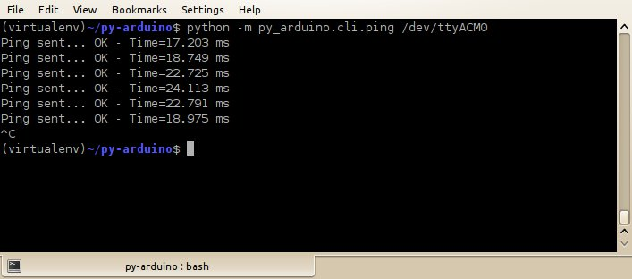
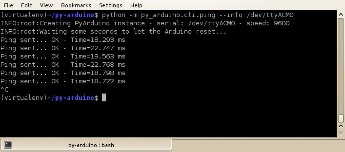
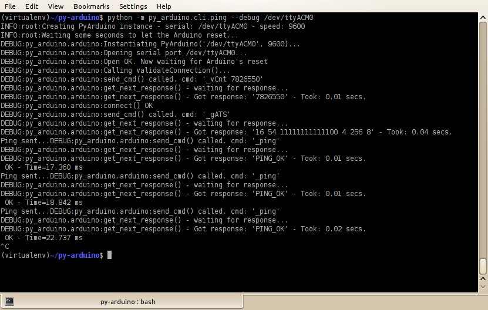
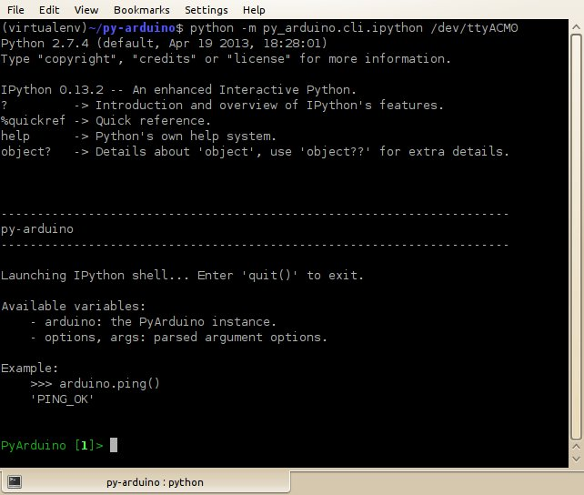

# py_arduino.cli.*: Reference

## ping

To check the connectivity to the Arduino

    $ python -m py_arduino.cli.ping /dev/ttyACM0

#### Default invocation

    $ python -m py_arduino.cli.ping /dev/ttyACM0

 

#### Showing logging's _info_ messages

    $ python -m py_arduino.cli.ping --info /dev/ttyACM0

 

#### Showing logging's _debug_ messages

    $ python -m py_arduino.cli.ping --debug /dev/ttyACM0

 

## ipython

Start an IPython interactive session.

    $ python -m py_arduino.cli.ipython /dev/ttyACM0

To use this, you'll need to install _ipython_ with:

    $ pip install ipython

Here you can see the interactive session with a customized message.
The sessions starts with the Arduino connected.

 

In this example, we import some constants, set the PIN 13 to `OUTPUT` mode,
and write a `LOW` first, and then a `HIGH`.

 

## analog_read

TODO

## analog_write

TODO

## digital_read

TODO

## digital_write

TODO
